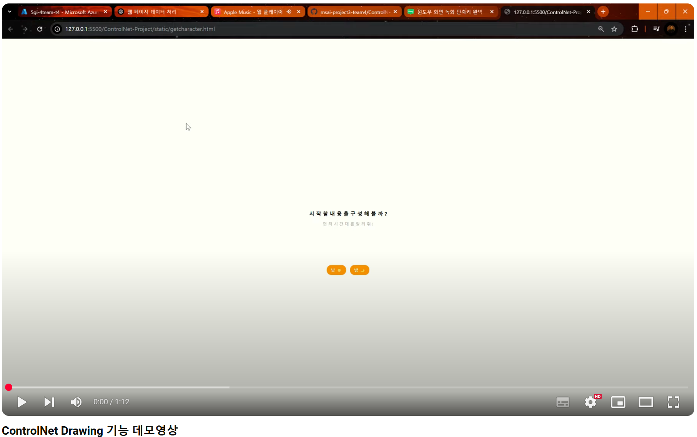
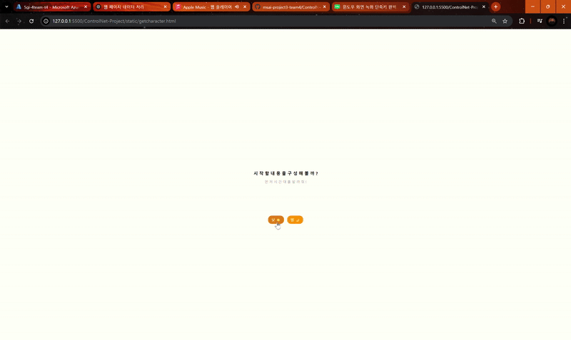

# 📌 ControlNet-Project
### ControlNet을 활용하여 사용자의 스케치를 기반으로 이미지 생성하는 Drawry 핵심기능

## 🚀 데모 영상  
[![Watch the video]https://youtu.be/23IraQ0k-Xk
## 🎬 실행 예제


## 📝 프로젝트 개요
ControlNet과 Stable Diffusion을 이용하여 사용자가 그린 스케치를 기반으로 고품질 이미지를 생성하는 기능능입니다.
사용자는 간단한 스케치를 그린 후, 특정 프롬프트를 추가하여 더욱 세밀한 이미지를 생성할 수 있습니다.

주요 기능
- 사용자가 선택한 프롬프트를 기반으로 AI 생성 이미지 개선
- Flask를 이용한 API 서버 운영
- ControlNet을 통한 스케치 기반 이미지 생성
- 웹 UI를 통해 직관적인 사용 경험 제공

## ⚙️ 기술 스택
- <b>Backend</b>: Flask, Python, ControlNet, Stable Diffusion
- <b>Frontend</b>: HTML, CSS, JavaScript
- <b>Model</b>: lllyasviel/control_v11p_sd15_scribble, Yntec/samaritan3dCartoon2MVAE
- <b>Deployment</b>: Azure VM
- <b>Data Format</b>: Base64 이미지 전송, JSON API 응답

## 📂 프로젝트 구조
ControlNet-Project/<p>
│── Model/                  # Model FineTuning<p>
│── static/<p>
│   ├── getcharacter.html    # 사용자 프롬프트 입력 페이지<p>
│   ├── Drawing.html         # 사용자 스케치 입력 페이지<p>
│   ├── makeimage.html       # 이미지 생성 및 결과 확인 페이지<p>
│   ├── src/                 # 이미지 및 스타일 파일<p>
│   ├── output/           # Flask가 생성한 이미지 저장 폴더<p>
│── app.py                   # Flask API 서버 (ControlNet 이미지 생성)<p>
│── README.md                # 프로젝트 설명 파일<p>
│── requirements.txt         # 설치파일

## 🚀 설치 및 실행 방법
### 1️⃣ 환경 설정
1. Python 가상 환경 생성
```
python -m venv venv<p>
source venv/bin/activate  # Mac/Linux<p>
venv\Scripts\activate  # Windows<p>
pip install -r requirements.txt
```

### 2️⃣ Flask 서버 실행
```
python app.py
```

### 3️⃣ 웹 애플리케이션 실행
```
cd static
python -m http.server 8000
```
### 📌 사용 방법
1️⃣ 프롬프트 입력 (getcharacter.html)
- 사용자가 시간, 장소, 행동을 선택하여 프롬프트를 설정합니다.

2️⃣ 스케치 입력 (Drawing.html)
- 사용자는 웹 UI에서 간단한 스케치를 그리고 그림 만들기 버튼을 눌러 ControlNet을 호출합니다.

3️⃣ 이미지 생성 (makeimage.html)

- Flask API가 ControlNet을 통해 이미지 3장을 생성합니다.
- /api/status를 주기적으로 확인하여 이미지 생성이 완료되면 자동으로 showimg 화면으로 이동합니다.

4️⃣ 이미지 선택 (showimg)
- 생성된 3개의 이미지를 비교하여 최종 선택합니다.

### 👨‍💻 개발자
이름: <b>남두현[BE - API및 서버담당]<p></b>
이메일: kndh2914@gmail.com<p>
GitHub: https://github.com/namduhus<p>


이름: <b>이예린[FE - UI/UX] <p></b>
이메일: yesrin14@gmail.com<p>
GitHub: https://github.com/y8r1n

이름: <b>이지수[Model - FineTuning]<p></b>
이메일: rachleejs@gmail.com<p>
GitHub: https://github.com/rachleejs

이름: <b>홍종현[FE - UI/UX]<p></b>
이메일: jnyg384@gmail.com<p>
GitHub: https://github.com/Jonghyun-Hong
